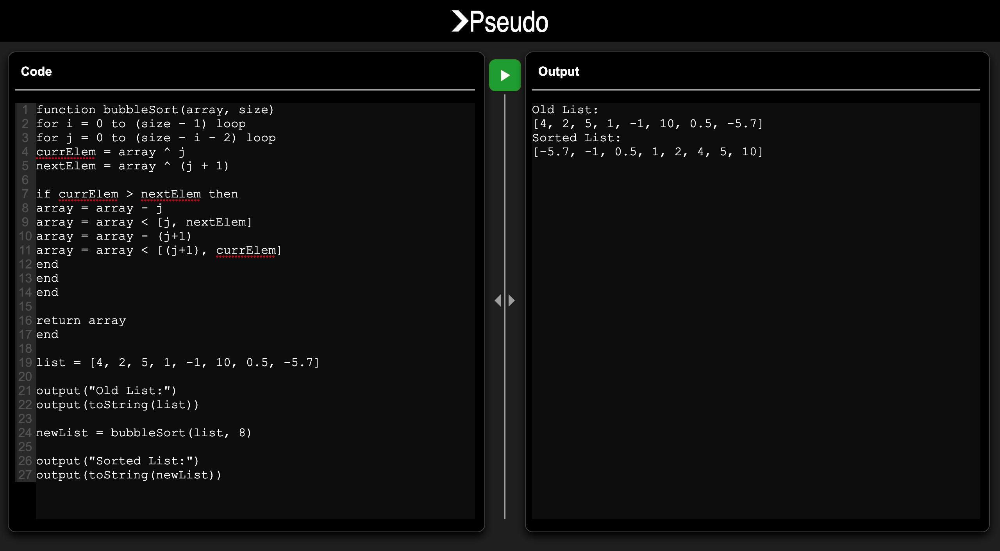

# Pseudo
A programming language with an integrated text editor and console

## Usage
Note: Make sure to have Angular installed for running this project locally. 

Clone the project:
`git clone https://github.com/granitdula/Pseudo.git`

Install all relevant packages:
`npm install`

Verify it works by trying to run it locally with:
`npm start`

You can also run unit tests with:
`npm test`

## Example Screenshot

*The Pseudo IDE showing an example implementation of the bubble sort algorithm.*